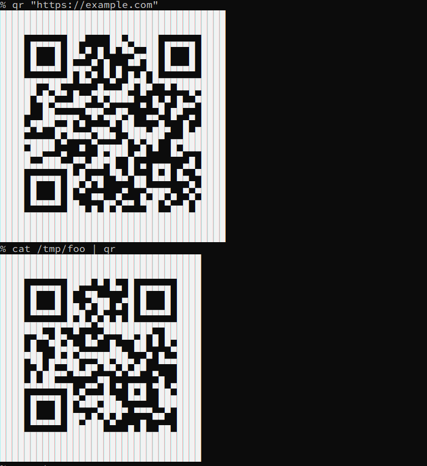

## What is this?

Show qr code for any text in terminal. (Yes terminal - no image). You can transfer to phone without going through the network or using a website. More details in [man qrencode](https://linux.die.net/man/1/qrencode)

## Install

### Ubuntu

    sudo apt-get install qrencode

## Function to copy to rc files

    qr () {
            qrencode $1 --type=ANSIUTF8 --level=HIGH --output=-
    }

## Invoking

    qr "Some text to copy to your phone from a computer"
    cat /tmp/some.txt | qr

### Known to work

* Ubuntu 18.04 
* zsh
